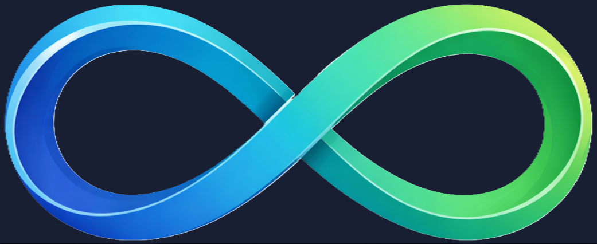
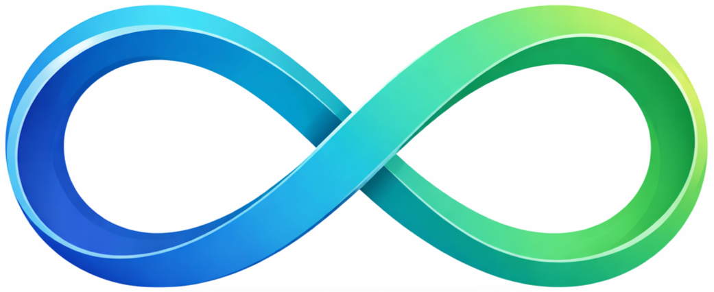

<html lang="nl">
<head>
  <meta charset="UTF-8" />
  <meta name="viewport" content="width=device-width, initial-scale=1.0" />
  <title>mijnwiskundeles – Persoonlijke bijles rekenen & wiskunde</title>
  
  
</head>
<body>

<header>
  

    

      
      
mijnwiskundeles

    

    

      <h1>Persoonlijke rekenen- en wiskundebijles in Valkenswaard</h1>
      
Sessies van 2 uur • Eerste les gratis • Basisschool & voortgezet onderwijs

      <a href="#boeken" class="btn">Boek een proefles</a>
    

  

</header>

<section>
  <h2>Over mij</h2>
  

    

      
Hi, ik ben Norbert. Ik help leerlingen uit het basis- en voortgezet onderwijs om rekenen en wiskunde te begrijpen door samen helderheid en vertrouwen op te bouwen.

      
Van oorsprong ben ik ingenieur en jarenlang heb ik gewerkt aan complexe technische systemen, waar precisie, logisch denken en zorgvuldigheid essentieel zijn. Die manier van denken neem ik mee in mijn bijlessen, ingewikkelde problemen terugbrengen tot iets dat overzichtelijk en begrijpelijk wordt.

	  
Wat mij onderscheidt, is rust en aandacht. Ik neem de tijd om te begrijpen waar een leerling vastloopt. Dat kan inhoudelijk zijn, maar vaak ook in onzekerheid, tempo of eerdere negatieve ervaringen met het vak. Ik geloof niet in labels of snelle conclusies. Elk kind leert anders, en daar stem ik mijn begeleiding op af.

	  
Mijnwiskundeles is ontstaan vanuit de overtuiging dat goede begeleiding begint bij serieus kijken, luisteren en uitleggen, zonder druk, maar met duidelijke structuur en heldere stappen.

	  

		<h3>Achtergrond</h3>
		<ul>
			<li>Ingenieursopleiding Systeem- en Computertechniek</li>
			<li>Master Besturingssystemen</li>
			<li>Ruim 14,5 jaar ervaring als embedded software engineer</li>
			<li>12,5 jaar werkzaam geweest bij DAF Trucks (Eindhoven)</li>
		</ul>
	  

    

    

      <!-- Eigen foto toevoegen -->
      
    

  

</section>

<section>
  <h2>Mijn aanpak</h2>
    

      

		

			<i data-lucide="user"></i>
		

        <h3>Persoonlijke aandacht</h3>
        
Elk kind verdient persoonlijke aandacht. Ik stem het tempo, de uitleg en de oefeningen af op het niveau, de leerstijl en het karakter van de leerling.

      

      

		

			<i data-lucide="book-open"></i>
		

        <h3>Kennis van de theorie is essentieel</h3>
        
Een heldere uitleg van de theorie is de basis. Met duidelijke voorbeelden zorgen we eerst dat de fundamenten stevig zijn, voordat we werken aan complexere opgaven.

      

      

		

			<i data-lucide="pen-tool"></i>
		

        <h3>Lead by example</h3>
        
Ik laat zien hoe je een wiskundig probleem aanpakt. We beginnen altijd met orde scheppen: wat is precies de opdracht, welke stappen horen daarbij en welke regels gelden?

      

      

		

			<i data-lucide="check-circle"></i>
		

        <h3>Realistische verwachtingen</h3>
        
Ik verwacht niet dat een leerling iets weet als dit nog niet is uitgelegd. Nieuwe stof bouwen we logisch en stap voor stap op.

      

      

		

			<i data-lucide="focus"></i>
		

        <h3>Rust en focus</h3>
        
Tijdens de les werken we in een rustige omgeving met aandacht voor concentratie, overzicht en logisch redeneren.

      

      

		

			<i data-lucide="brain"></i>
		

        <h3>Begrip vóór snelheid</h3>
        
Snelheid is niet het doel. Ik controleer of een leerling kan uitleggen waarom een oplossing werkt.

      

      

		

			<i data-lucide="repeat"></i>
		

        <h3>Consistency is key</h3>
        
Door te oefenen, fouten te maken en te verbeteren wordt kennis duurzaam opgebouwd.

      

      

		

			<i data-lucide="layers"></i>
		

        <h3>Alle vereiste onderwerpen</h3>
        
We behandelen alle onderwerpen die bij het niveau horen, zonder te blijven hangen in één onderdeel.

      

      

		

			<i data-lucide="shield-check"></i>
		

        <h3>Zelfvertrouwen</h3>
        
In een veilige en ontspannen sfeer groeit zelfvertrouwen vanzelf door begrip en succeservaringen.

      

    

  

</section>

<section>
  <h2>Voor wie?</h2>
  <ul>
    <li>Basisschool: groep 5 t/m 8.</li>
    <li>Voortgezet onderwijs: vmbo, havo, vwo (incl. gymnasium).</li>
    <li>Wiskunde A, B, C en D.</li>
    <li>Taal: Nederlands (B2) en Engels.</li>
  </ul>
</section>

<section>
  <h2>Lesopzet & locatie</h2>
  
Elke sessie duurt 2 uur (twee blokken van 50 minuten met pauze). Wekelijkse lessen zijn standaard, tweewekelijkse lessen zijn beperkt beschikbaar (in de oneven weken, op vrijdag en zaterdag).

  
Locatie: Dommelseweg 26, Kamer 7, 5554 NR Valkenswaard.

  

    
    
  

</section>

<section>
  <h2>Tarieven & voorwaarden</h2>
  
<strong>€35 per uur</strong> • €70 per sessie van 2 uur • Eerste les gratis

  <ul>
    <li>Maandelijkse factuur per e-mail.</li>
	<li>De dag na de proefles sturen we een korte e-mail om te vragen hoe het is gegaan en of je verder wilt met de lessen.</li>
    <li>Dag en tijd blijven vast na de proefles.</li>
    <li>Wekelijks opzegbaar.</li>
  </ul>

  

  Alle genoemde tarieven zijn vrijgesteld van btw.

</section>

<section>
  <h2>Jaarrooster</h2>
  

	<a href="docs/Jaarrooster 2026.pdf" class="btn" download>
		Download jaarrooster (PDF)
	</a>
	
Het jaarrooster bevat alle lesvrije periodes en vakanties.

  

</section>

<section id="boeken">
  <h2>Les boeken</h2>
  
Let op: de gekozen dag en tijd blijven vast voor volgende lessen.

  <form action="https://example-mail-server.com/send" method="post">
    <label>Frequentie</label>
    <select name="frequentie" required>
      <option value="wekelijks">Wekelijks</option>
      <option value="tweewekelijks">Tweewekelijks (oneven weken)</option>
    </select>

    <label>Datum proefles</label>
    <input type="date" name="datum" required />

    <label>Tijd</label>
    <select name="tijd" id="tijdSelect" required></select>

    <label>Naam ouder</label>
    <input type="text" name="ouder" required />

    <label>E-mail ouder</label>
    <input type="email" name="email" required />

    <label>Naam leerling</label>
    <input type="text" name="leerling" required />

    <label>School</label>
    <select name="school">
      <option>Basisschool</option>
      <option>Voortgezet onderwijs</option>
    </select>

    <label>Groep / Niveau</label>
    <input type="text" name="niveau" />

    <label>Wiskundevak</label>
    <select name="vak">
      <option>n.v.t.</option>
      <option>A</option><option>B</option><option>C</option><option>D</option>
    </select>

    <label>Voorkeur taal</label>
    <select name="taal"><option>Nederlands</option><option>Engels</option></select>

    <label>Opmerkingen</label>
    <textarea name="opmerkingen"></textarea>

    <button type="submit" class="btn">Verstuur aanvraag</button>
  </form>
</section>

<footer>
  

  
  <strong>mijnwiskundeles</strong> • KvK 99006049
  

  
Dommelseweg 26, Kamer 7, 5554 NR Valkenswaard

  
E-mail: mijnwiskundeles@gmail.com • Tel: 06 34174213

</footer>

</body>
</html>